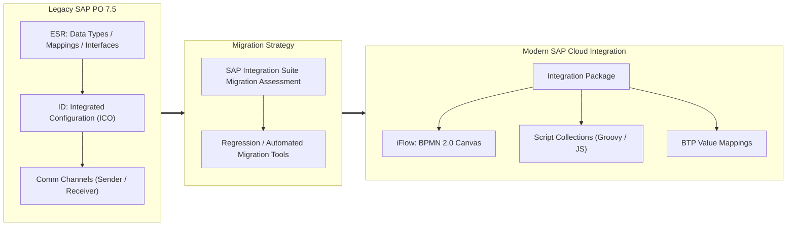

# 🚀 SAP PO/PI to SAP Cloud Integration (CPI) Migration Blueprints & Patterns

An enterprise-grade repository and architectural blueprint for migrating legacy **SAP Process Orchestration (PO 7.5 Single-Stack AEX / Dual-Stack PI)** to **SAP Cloud Integration (CPI)** within the **SAP BTP Integration Suite**.

This repository provides working Groovy scripts, XSLT transformations, iFlow architecture patterns, and side-by-side artifact mapping references.

---

## 📑 Table of Contents

1. [Architecture & Paradigm Shift](#-architecture--paradigm-shift)
2. [PO/PI to CPI Object Mapping Guide](#-popi-to-cpi-object-mapping-guide)
3. [Production Groovy Script Library](#-production-groovy-script-library)
4. [Modern XSLT 3.0 Mappings](#-modern-xslt-30-mappings)
5. [iFlow Design Patterns](#-iflow-design-patterns)
6. [Testing & Regression Strategy](#-testing--regression-strategy)

---

## 🏛️ Architecture & Paradigm Shift

In SAP PO/PI, integration logic was strictly split between the **Enterprise Services Repository (ESR)** (design-time contracts, data types, message mappings) and the **Integration Directory (ID)** (configuration-time Integrated Configuration Objects - ICOs, communication channels, party/service definitions).

In **SAP Cloud Integration (CPI)**, this is unified into self-contained, version-controlled **Integration Packages** containing **Integration Flows (iFlows)** following BPMN 2.0 standards:

---

## 🔄 PO/PI to CPI Object Mapping Guide

| SAP PO / PI 7.5 Component | SAP Cloud Integration (CPI) Equivalent | Architectural Recommendation |
| :--- | :--- | :--- |
| **Integrated Configuration (ICO)** | **Integration Flow (iFlow)** | Decompose complex monolith ICOs into modular iFlows using `ProcessDirect` adapter. |
| **Communication Channel (Sender/Receiver)** | **iFlow Adapter Endpoint** | Use Cloud Connector for on-prem backends (RFC, IDoc, SOAP). Replace File adapter with SFTP/S3. |
| **Java User Defined Functions (UDFs)** | **Apache Groovy Script Collections** | Migrate reusable UDFs into centralized Script Collections rather than inline iFlow scripts. |
| **Value Mapping (Integration Directory)** | **BTP Value Mapping Group** | Store key-value dictionaries in Value Mapping artifacts or consume via BTP OData API. |
| **RFC / IDoc Lookup (Java UDF)** | **Request-Reply Step (RFC/OData Adapter)** | Decouple data enrichment from mappings; execute lookups via Request-Reply steps before mapping. |
| **ccBPM / NW BPM (Multi-step logic)** | **Router, Multicast, Splitter, Gather, Looping Process** | Model orchestration natively inside iFlow or leverage SAP Build Process Automation for human workflows. |
| **Alert Rules / Alert Inbox** | **Exception Subprocess + MPL Logging** | Implement standard Exception Subprocess handling alerting via Webhook/Email or SAP Cloud ALM. |
| **File Content Conversion (FCC)** | **XML-to-CSV / CSV-to-XML Converter** | Use native CPI converter steps or streaming Groovy for high-volume non-standard fixed-width files. |

Detailed comparison guide available at: [`docs/PO_to_CPI_Mapping_Matrix.md`](docs/PO_to_CPI_Mapping_Matrix.md).

---

## 💻 Production Groovy Script Library

Explore the scripts located in [`src/groovy/`](src/groovy/):

* **[`PayloadLogger.groovy`](src/groovy/PayloadLogger.groovy)**: Production MPL logger that dynamically checks an execution flag (e.g. `DEBUG_LOG_PAYLOAD = true`), masks sensitive PII (credit cards, passwords, SSN), and logs payloads as attachments in the Message Processing Log (MPL).
* **[`DynamicRouter.groovy`](src/groovy/DynamicRouter.groovy)**: Inspects incoming payloads (JSON or XML) and dynamically computes target routing endpoints and receiver keys without parsing large payloads multiple times.
* **[`HmacSha256Signer.groovy`](src/groovy/HmacSha256Signer.groovy)**: Calculates cryptographic HMAC-SHA256 signatures for authenticating third-party webhook requests (e.g. Shopify, Stripe, GitHub, Twilio).
* **[`CustomExceptionMapper.groovy`](src/groovy/CustomExceptionMapper.groovy)**: Catches runtime adapter exceptions, parses root cause stack traces, and builds a standardized RFC 7807 `Problem Details` JSON error payload.

---

## 📄 Modern XSLT 3.0 Mappings

Explore [`src/xslt/IDoc_To_CanonicalJSON.xslt`](src/xslt/IDoc_To_CanonicalJSON.xslt):
* Demonstrates converting high-volume legacy SAP IDocs (`ORDERS05` purchase orders) directly into a standardized modern Canonical JSON format using streaming XSLT 3.0 in CPI.
* Eliminates the need for intermediary Graphical Message Mappings for high-throughput scenarios, saving memory and CPU execution cycles.

---

## ⚙️ iFlow Design Patterns

### 1. ProcessDirect Decoupling Pattern
Avoid duplicating authentication and common transformations by splitting integrations into:
* **Inbound Adapter iFlow**: Authenticates client, validates payload against schema, normalizes headers.
* **Core Business Logic iFlow**: Executes enrichment, mapping, routing.
* **Outbound Target iFlow**: Handles connectivity to destination (Salesforce, S/4HANA, Bank).

### 2. Idempotent Retry & Dead Letter Queue (DLQ)
* Using **JMS Queues** or **Data Store**:
* Stores incoming message IDs to prevent double-processing.
* When maximum retry count is reached, message automatically diverts to a dedicated DLQ queue for manual intervention.

---

## 🧪 Testing & Regression Strategy

When migrating from SAP PO to CPI, verification must ensure zero functional regressions:
1. **Payload Extraction**: Export production payloads from SAP PO using Transaction `SXMB_MONI` or Java Message Monitor.
2. **Automated Testing Suite**: Execute side-by-side regression testing using tools like Figaf, Int4 IFTT, or custom Postman Runner collections.
3. **Cutover Readiness**: Leverage Parallel Run (Dual-Routing) during cutover windows to validate live business output before deprecating PO channels.
